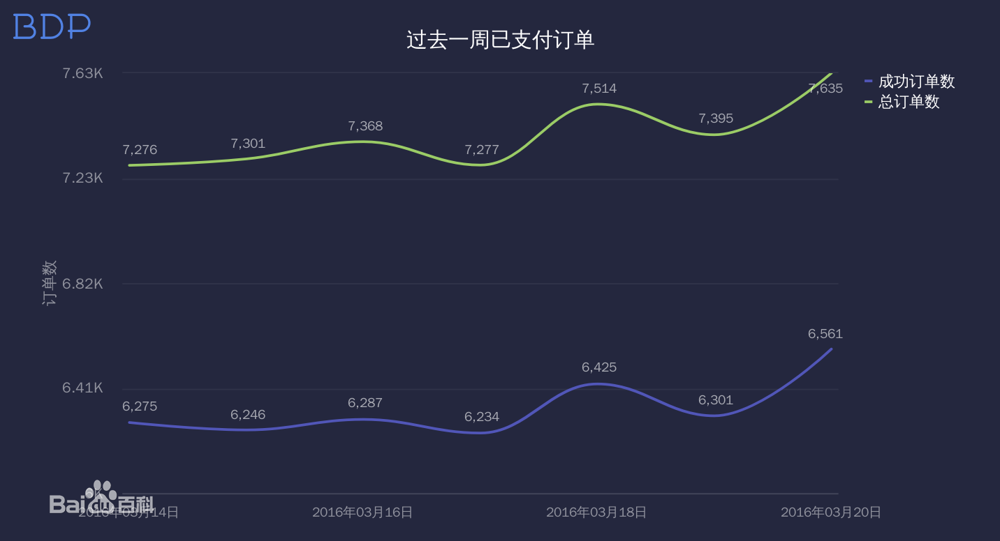
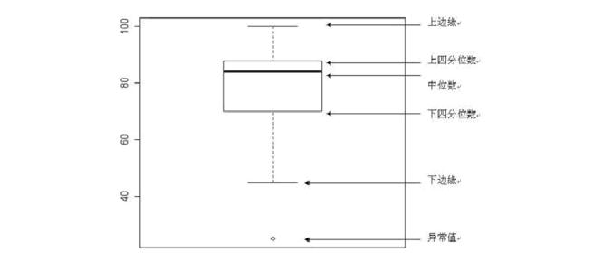
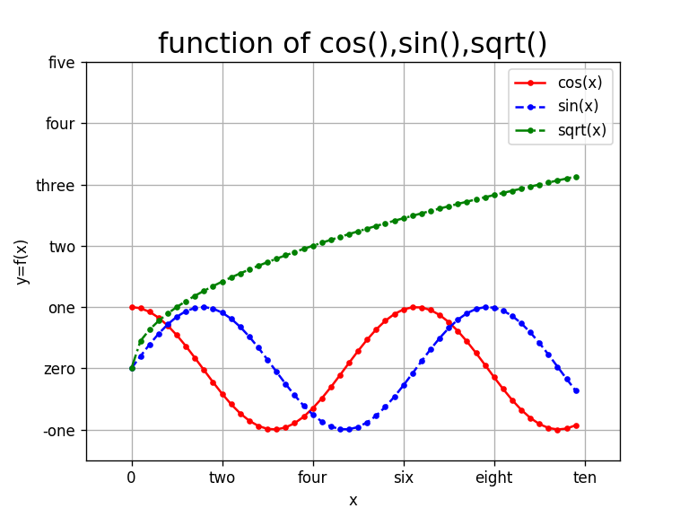
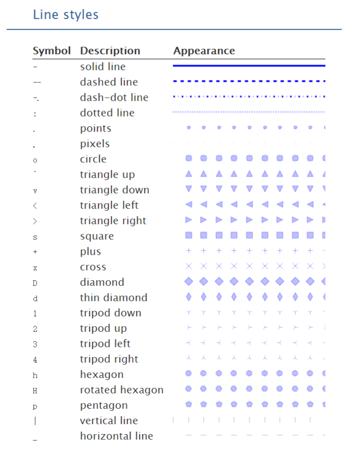
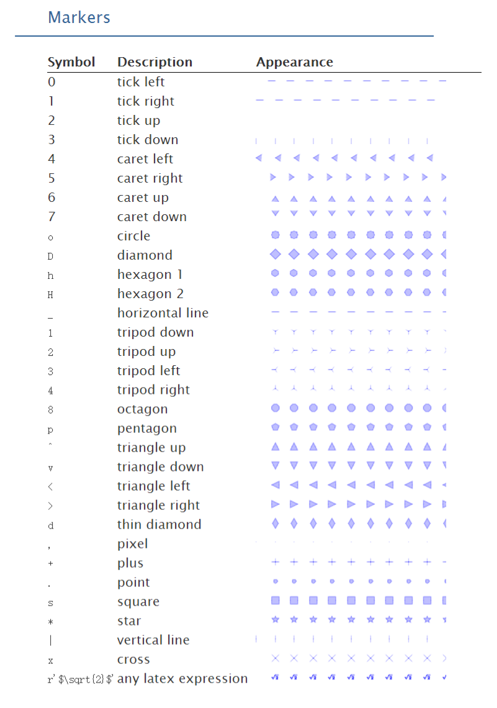
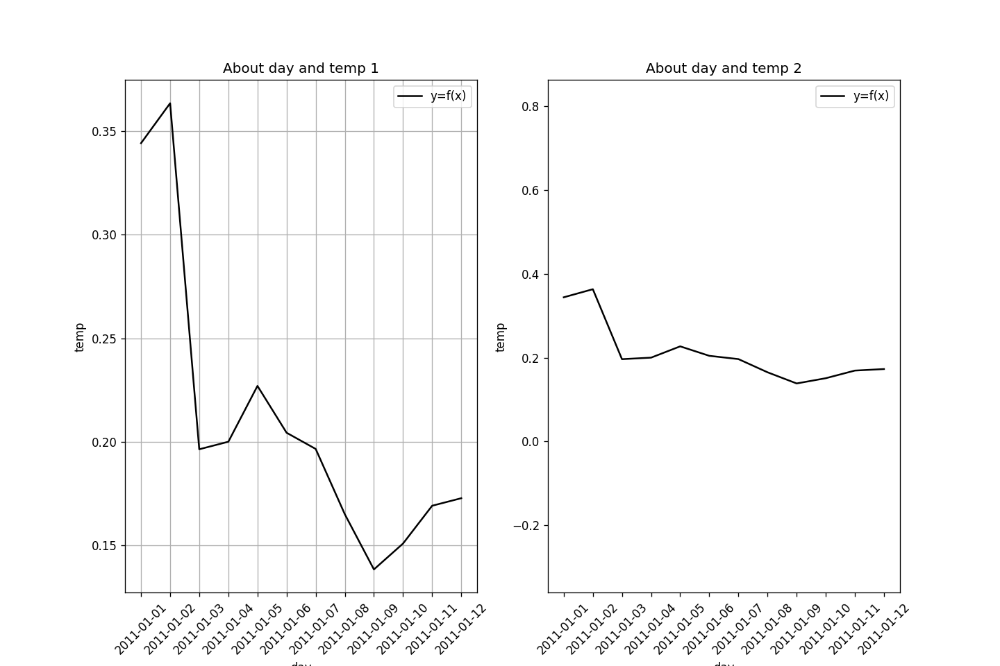
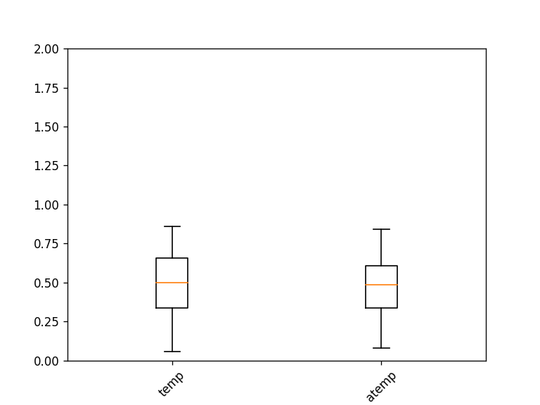

Matplotlib模块
==============================
|作者：李天翔|
| ---|
|日期：2019-9-27|

--------------

[TOC]


## 一、Matplotlib模块简介

### 1. 什么是Matplotlib模块
>* Matplotlib是一个Python 2D绘图库，可以生成各种硬拷贝格式和跨平台交互式环境的出版物质量数据。Matplotlib可用于Python脚本，Python和IPython shell，Jupyter笔记本，Web应用程序服务器和四个图形用户界面工具包。

>* Matplotlib试图让简单易事的事情成为可能。你只需几行代码即可生成绘图，直方图，功率谱，条形图，误差图，散点图等。有关示例，请参阅示例图库和缩略图库。

>* 对于简单的绘图，pyplot模块提供类似MATLAB的接口，特别是与IPython结合使用时。 对于高级用户，你可以通过面向对象的界面或通过MATLAB用户熟悉的一组函数完全控制线型，字体属性，轴属性等。

### 2. Matplotlib 官方文档
> 官方中文文档地址：https://www.matplotlib.org.cn/home.html  (官方不提供pdf版本下载)
> 官方文档中含有一些示例库，绘图命令列表等可提供前期学习使用。(建议多浏览官方文档)

## 二、Matplotlib的使用
### 1.Matplotlib的安装
> 本文档旨在介绍绘制各种图表之间的代码及方法差异，安装部分请详细浏览一下网址，在这里就不多展开叙述
> 官方安装介绍地址：https://matplotlib.org/users/installing.html#installing

### 2.在pycharm中使用Matplotlib模块

> 直接调用matplotlib模块。
```python
import matplotlib.pyplot as plt
```

### 3.Matplotlib中常用的几种统计图简介

#### 3.1 折线图

##### 折线图简介

> 折线图是排列在工作表的列或行中的数据可以绘制到折线图中。折线图可以显示随时间（根据常用比例设置）而变化的连续数据，因此非常适用于显示在相等时间间隔下数据的趋势。在折线图中，类别数据沿水平轴均匀分布，所有值数据沿垂直轴均匀分布。

##### 折线图使用场景

> 如果分类标签是文本并且代表均匀分布的数值（如月、季度或财政年度），则应该使用折线图。当有多个系列时，尤其适合使用折线图 — 对于一个系列，应该考虑使用类别图。如果有几个均匀分布的数值标签（尤其是年），也应该使用折线图。如果拥有的数值标签多于十个，请改用散点图。另外，折线图是支持多数据进行对比的。

> 例如两个品牌之间单一项数据对比，并反映出随时间的变化趋势。

应用场景示例：




#### 3.2 柱状图

##### 柱状图简介

> 柱状图(bar chart)，是一种以长方形的长度为变量的表达图形的统计报告图，由一系列高度不等的纵向条纹表示数据分布的情况，用来比较两个或以上的价值（不同时间或者不同条件），只有一个变量，通常利用于较小的数据集分析。柱状图亦可横向排列，或用多维方式表达。

##### 柱状图使用场景

> 主要用于数据的统计与分析，早期主要用于数学统计学科中，数码相机的曝光值用柱状图表示，数码相机的曝光值用柱状图表示，到现代使用已经比较广泛，比如现代的电子产品和一些软件的分析测试，如电脑，数码相机的显示器和photoshop上都能看到相应的柱状图。<font color=red>优势是易于比较各组数据之间的差别。</font>

> 例如不同牌子手机之间各方面性能的差别对比，饿了么2018年和2019年第一季度业绩对比（同期对比）。

应用场景示例：


#### 3.3 散点图

##### 散点图简介

> 散点图是指在回归分析中，数据点在直角坐标系平面上的分布图，散点图表示因变量随自变量而变化的大致趋势，据此可以选择合适的函数对数据点进行拟合。
> 用两组数据构成多个坐标点，考察坐标点的分布，判断两变量之间是否存在某种<font color=red>关联</font>或总结坐标点的分布模式。散点图将序列显示为一组点。值由点在图表中的位置表示。类别由图表中的不同标记表示。散点图<font color=red>通常用于比较跨类别的聚合数据。</font>

##### 散点图使用场景
> 当要在不考虑时间的情况下比较大量数据点时，请使用散点图。散点图中包含的数据越多，比较的效果就越好。对于处理值的分布和数据点的分簇，散点图都很理想。如果数据集中包含非常多的点（例如，几千个点），那么散点图便是最佳图表类型。
> 当欲同时考察多个变量间的相关关系时，若一一绘制它们间的简单散点图，十分麻烦。此时可利用散点图矩阵来同时绘制各自变量间的散点图，这样可以快速发现多个变量间的主要相关性，这一点在进行<font color=red>多元线性回归时</font>显得尤为重要。

应用场景示例：


#### 3.4 盒图/箱式图

##### 盒图简介

> 盒图是在1977年由美国的统计学家约翰·图基(John Tukey)发明的。它由<font color=red>五个数值点组成：最小值(min)，下四分位数(Q1)，中位数(median)，上四分位数(Q3)，最大值(max)</font>。也可以往盒图里面加入平均值(mean)。如上图。下四分位数、中位数、上四分位数组成一个“带有隔间的盒子”。上四分位数到最大值之间建立一条延伸线，这个延伸线成为“胡须(whisker)”。
> 由于现实数据中总是存在各式各样地“脏数据”，也成为“离群点”，于是为了不因这些少数的离群数据导致整体特征的偏移，将这些离群点单独汇出，而盒图中的胡须的两级修改成最小观测值与最大观测值。这里有个经验，就是最大(最小)观测值设置为与四分位数值间距离为1.5个IQR(中间四分位数极差)。
> IQR = Q3-Q1，即上四分位数与下四分位数之间的差，也就是盒子的长度。
> 最小观测值为min = Q1 - 1.5*IQR，如果存在离群点小于最小观测值，则胡须下限为最小观测值，离群点单独以点汇出。如果没有比最小观测值小的数，则胡须下限为最小值。
> 最大观测值为max = Q3 +1.5*IQR，如果存在离群点大于最大观测值，则胡须上限为最大观测值，离群点单独以点汇出。如果没有比最大观测值大的数，则胡须上限为最大值。

##### 盒图使用场景

> 直观地识别数据集中的异常值(查看离群点)。
> 判断数据集的数据离散程度和偏向(观察盒子的长度，上下隔间的形状，以及胡须的长度)。
> 总结：盒图主要用于关注<font color=red>数据异常值，偏态和尾重，数据的形状</font>。

盒图各个显示位置的意义：


## 三、在Pycharm中绘制各种图表

### 1.绘制折线图（多个曲线同时存在一个图中）

#### 1.1 代码实现
```python

import numpy as np
import matplotlib.pyplot as plt
# from pylab import *
# plt.rcParams['font.sans-serif'] = ['SimHei'] #网上搜索可以设置中文编码的方法，但不成功
# plt.rcParams['axes.unicode_minus'] = False

# 定义数据部分
x = np.arange(0.0, 10, 0.2) #设置一个从0到10，每隔0.2取一个数的array
y1 = np.cos(x)
y2 = np.sin(x)
y3 = np.sqrt(x)

# 绘制基本曲线(color为曲线颜色，linewidth为曲线宽度，linestyle为曲线样式（详见line_style.png），
# marker为曲线里面每一个数据点的样式（详见marks.png），label为该曲线的标签（声明之后在下面设置图例里面引用）)
plt.plot(x, y1, color='red', linewidth=1.5, linestyle='-', marker='.',label='cos(x)')
plt.plot(x, y2, color='blue', linewidth=1.5, linestyle='--', marker='.',label='sin(x)')
plt.plot(x, y3, color='green', linewidth=1.5, linestyle='-.', marker='.',label='sqrt(x)')

# 设置x，y轴的刻度取值范围
plt.xlim(-1, x.max() * 1.1)
plt.ylim(-1.5,4.0)
#设置x，y轴的刻度标签值
plt.xticks([0,2,4,6,8,10],['0',r'two',r'four',r'six',r'eight',r'ten'])
plt.yticks([-1,0,1,2,3,4,5],[r'-one',r'zero',r'one',r'two',r'three',r'four',r'five'])
#设置标题
plt.title('function of cos(),sin(),sqrt()',fontsize=19)#fontsize为标题大小
plt.xlabel('x')
plt.ylabel('y=f(x)')
#设置图例
plt.legend(loc='best')#前提是在plt.plot函数中指明了标签(label=)才可以使用
#设置网格线
plt.grid(True)#默认为无
#保存为图片
# plt.savefig('./data/image.png',dpi=120)#dpi为图片像素

#显示统计图
plt.show()
```
代码运行结果如下：



#### 1.2 作图思路及解释
    这张图旨在画出3种曲线（cos，sin，sqrt）在同一张图上的对比。
    思路分为4部分：
    1.准备数据（包含将matplotlib模块动态设置为中文编码，在上述代码中暂未实现，待笔者研究清楚后再进行文章的更新）
    2.绘制曲线（注意：在matplotlib模块中，使用了plt.plot()方法后并不能立即显示出绘制的图表，必须在最后使用plt.show()方法打印显示出图表），并对曲线的一些属性进行设置，如曲线颜色、曲线粗细、定义曲线的标签等
    3.对图标的x，y轴的属性进行设置，如标题，xy轴的取值范围，xy轴的刻度标签值等
    4.保存为图片，显示统计图
    此次绘图用的是plt.plot()方法，此方法是我认为最基本的一种绘制折线图的办法，但不能实现多子图绘制

#### 1.3 小结
    plot方法中需注意的是：
    1.对曲线的属性的设置是给plot方法传参，常用参数如下：

| 参数 | 意义 |
| --- | ---- |
| color | 颜色 |
| linewidth | 曲线宽度 |
| linestyle | 曲线样式 |
| marker | 数据点样式 |
| label | 曲线标签 |

<font color=red>注：如果要在图表中显示曲线代表的名称（图例），则一定要设置曲线标签，然后在下一步中设置图例。
曲线样式及数据点样式对应的数值参考下列表格</font>

>linestyle参数如下：


>marker参数如下：


    2.plt中常用设置x，y轴的方法有：

| 方法 | 意义 |
| ---- | ---- |
| plt.xlim()/plt.ylim() | x,y轴刻度取值范围(输入两个数值或者一些常用函数如max(x)) |
| plt.xticks()/plt.yticks() | x,y轴刻度的标签值(输入两个列表，分别对应默认标签名称和更改后的标签名称) |
| plt.xlabel()/plt.ylabel() | x,y轴的标题 |
| plt.title() | 整个图表的标题(可以传入参数fontsize改变标题字体大小) |
| plt.legend() | 设置图例(必须传入参数loc=’best‘或者其他位置来设置图例放置的位置，前提是在plt.plot()中设置了标签(label=)才可以使用)|
| plt.grid() | 设置网格线，输入一个布尔型的值，默认为False |

<font color=red>注：上述大部分方法仅在plt.plot()绘制图表时使用，后续所用的绘制图表方法不适用</font>

### 2.绘制折线图（子图形式呈现）
#### 2.1 代码实现
```python
import matplotlib.pyplot as plt
import pandas as pd

#准备数据
data = pd.read_csv('./data/day.csv')
data = data[['dteday','temp']]  #提取文档中 日期（dteday）和温度（temp）两列
data = data[0:12]       #取前12个行数据
# print(data.head())

#开始作图
fig = plt.figure(figsize=(12,8))#创建figure对象,可以设置显示的图框的长宽
ax1 = fig.add_subplot(1,2,1)#添加子图，按一行两列显示，第三个参数为放置位置
ax2 = fig.add_subplot(1,2,2)

ax1.plot(data['dteday'],data['temp'],color = 'black',label='y=f(x)')
ax1.set_xticklabels(data['dteday'],rotation=45) #设置x轴的标签值，角度为45度
ax1.set_xlabel('day')
ax1.set_ylabel('temp')
ax1.set_title('About day and temp 1')
ax1.legend(loc='best')
ax1.grid(True)

ax2.plot(data['dteday'],data['temp'],color = 'black',label='y=f(x)')
# ax2.set_xlim(min(data['dteday'])*2,max(data['dteday'])*2) #日期不能使用max和min函数
ax2.set_ylim(min(data['temp'])-0.5,max(data['temp'])+0.5)
ax2.set_xticklabels(data['dteday'],rotation=45)
ax2.set_xlabel('day')
ax2.set_ylabel('temp')
ax2.set_title('About day and temp 2')
ax2.legend(loc='best')


plt.show()
plt.close()
```
代码运行结果如下：



#### 2.2 作图思路及解释
    本次作图使用的数据是一个关于日期和对应温度等信息的表格（其他信息我也看不懂），此表格记录的数据量比较大，
    因此本次绘图仅采用了日期、温度两列，前12行的数据作为绘制折线图的示例。
    并且使用相同的数据用一行两列子图的形式展示。
    本次作图的方法跟前一种直接调用plt.plot()不同，用的是创建figure对象然后在该对象上添加2张子图的方法。

#### 2.3 小结

> 1.本次作图是旨在呈现温度随日期变化而变化的规律，所以x轴使用dteday列的数据，y轴使用temp列的数据。而第一种方法y轴使用的是一个函数，所以在plt.plot()中只需要传入该函数。这点两种方式略有不同。
> 2.这次使用的是子图对象来plot()，因此写法是：ax1.plot(),ax1.set_xlabel() 等。
> 3.值得注意的是，因为我们绘制两张子图，因此每张子图的曲线样式、xy轴的样式都要分别设置，且<font color=red>设置的函数跟plt.plot()不同</font>，详见下表。

| 方法 | 意义 |
| ---- | ---- |
| ax.set_xlim()/ax.set_ylim() | x,y轴刻度取值范围(输入两个数值或者一些常用函数如max(x)) |
| ax.set_xticklabels()/ax.set_yticklabels() | x,y轴刻度的标签值(输入两个列表，分别对应默认标签名称和更改后的标签名称,还可以输入参数rotation改变标签角度) |
| ax.set_xlabel()/ax.set_ylabel() | x,y轴的标题 |
| ax.set_title() | 整个图表的标题(可以传入参数fontsize改变标题字体大小) |
| ax.legend() | 设置图例(必须传入参数loc=’best‘或者其他位置来设置图例放置的位置，前提是在ax.plot()中设置了标签(label=)才可以使用)|
| ax.grid() | 设置网格线，输入一个布尔型的值，默认为False |

### 3.绘制散点图
#### 3.1 代码实现
```python
import matplotlib.pyplot as plt
import pandas as pd

data = pd.read_csv('./data/day.csv')
col = ['temp','atemp']
data=data[col]

fig,ax = plt.subplots() #plt.subplots() 返回一个 Figure实例fig 和一个 AxesSubplot实例ax
ax.scatter(data['temp'],data['atemp'])
ax.set_xlabel('temp')
ax.set_ylabel('atemp')

# plt.savefig('./data/散点图.png',dpi=120)
plt.show()
plt.close()
```

代码运行结果如下：


#### 3.2 作图思路及解释
> 本次作图使用上一个图同样数据，但这次选取了temp和atemp两列所有的行数据(大约730条，因此这个图有1460个数据点)。散点图旨在观测两个变量之间的某种关联以及分布，此图结果也能较为明显的显示出两个变量间呈线性分布。绘图方法：在plt.subplots()中获取两个返回值（Figure实例fig 和一个 AxesSubplot实例ax），再通过ax.scatter()来直接画出。至于曲线样式、xy轴的样式跟上一张图一样，这里就不展开和解释了。在绘制完成后，有趣的发现，有一个点是明显的异常值，在后续的数据清洗中可以适当的清理这个数据。

#### 3.3 小结
> 这张图没什么特殊的，唯一注意的是创建实例fig和实例ax（目前对fig和ax的理解还不是很透彻，期待以后补充这一块的内容），然后使用ax.scatter()直接画出散点图。

### 4.绘制盒图（箱式图）
#### 4.1 代码实现
```python
import matplotlib.pyplot as plt
import pandas as pd

data = pd.read_csv('./data/day.csv')

fig,ax = plt.subplots()
data_columns=['temp','atemp']
ax.boxplot(data[data_columns].values)

ax.set_xticklabels(data_columns,rotation=45)#设置x轴标签
ax.set_xlabel('type')#设置x轴标题

ax.set_ylim(0,2)#设置y轴上下限

# plt.savefig('./data/盒图.png',dpi=120)
plt.show()
```

代码运行结果如下：



#### 4.2 作图思路及解释
> 这张图并没有什么特别需要介绍的，创建实例ax，然后通过ax.boxplot()函数直接画出，曲线样式和xy轴样式同上两种一样。

#### 4.3 小结
> 这张图画的比较简介，因为没涉及太多新的地方，简单做一下介绍。另外，<font color=red>柱状图</font>的画法是把ax.boxplot()改变成ax.bar()函数，其他步骤是一样的（当然里面传入的x,y的数据也不一样哈）。

## 四、总结及后记
> 这篇笔记主要展示了3种不同图表在Matplotlib中的画法，折线图使用plt.plot()方法直接画出，多个子图通过创建figure对象再添加多个子图实例ax1、ax2等实现，散点图盒图柱状图通过创建ax实例再调用相应方法就能顺利得到。至于曲线样式、xy轴样式等设置，也要视乎用哪种画法来调用相应的函数来制定（见1.3和2.3后的表格）。

> 笔者在经历一天半时间的Matplotlib模块学习以及大半天整理笔记之后，对这几种图的画法有了比较清晰的理解，虽然所实现的效果不是太完善，而且有部分内容亦不求甚解，但笔者相信在往后的日子里面会逐渐吃透这个模块的内容，不断锤炼绘图的技巧，争取成为一个在数据分析行业有一定建树的工作者。共勉。

